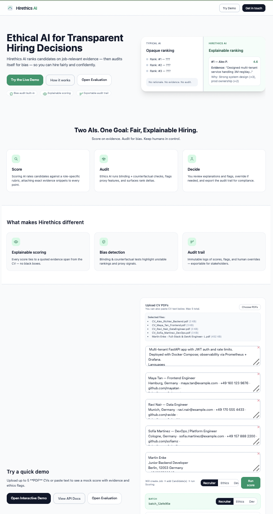
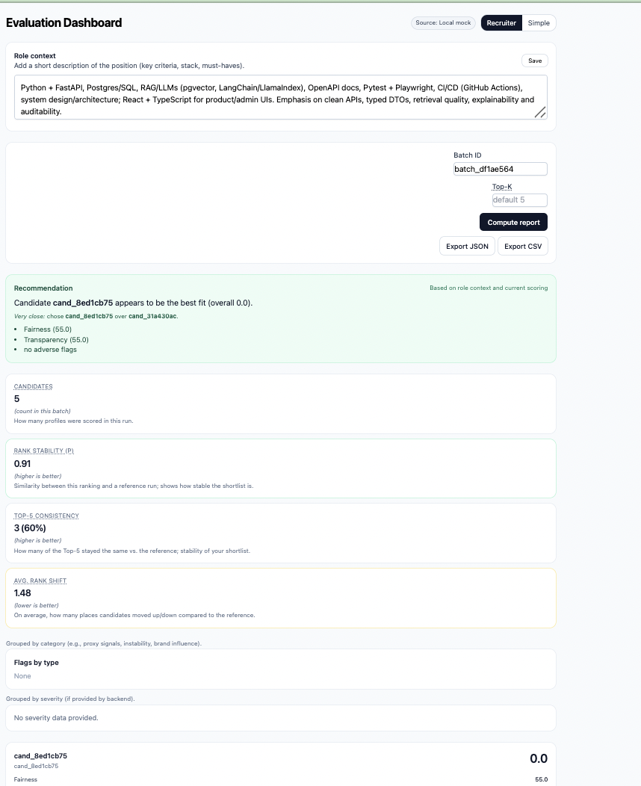

# Hirethics AI — Transparent, Audited Candidate Scoring

Hirethics AI is a small, end-to-end demo that **scores candidates on job-relevant evidence** and **audits itself for bias** via blinding checks. It’s designed for two audiences:





- **Recruiters & hiring managers** — get a simple, explainable overview of why a candidate ranks where they do, plus a light-touch ethics summary.
- **Developers & AI practitioners** — see exactly how scoring, blinding, flagging, and evaluation are implemented, with clear API boundaries and a pluggable LLM scorer.

> ⚠️ **Demo & Development:** CVs are temporarily stored in browser `localStorage`; backend stores no persistent data. Designed for experimentation and safe testing. Real CVs can be used, but all data is ephemeral. RAG support is planned for future development.

---

## Table of contents

- [Hirethics AI — Transparent, Audited Candidate Scoring](#hirethics-ai--transparent-audited-candidate-scoring)
  - [Table of contents](#table-of-contents)
  - [Why this project?](#why-this-project)
  - [What’s included (today)](#whats-included-today)
    - [Frontend (Vite + React + Tailwind)](#frontend-vite--react--tailwind)
    - [Backend (FastAPI)](#backend-fastapi)
  - [Screens \& flows](#screens--flows)
  - [Quick start](#quick-start)
    - [Backend](#backend)
    - [Frontend](#frontend)
  - [Configuration](#configuration)
  - [Architecture](#architecture)
  - [API reference (Demo)](#api-reference-demo)
  - [Scoring \& bias audit](#scoring--bias-audit)
  - [Viewer modes](#viewer-modes)
  - [Roadmap](#roadmap)
  - [FAQ](#faq)
  - [Contributing](#contributing)
  - [License](#license)

---

## Why this project?

Hiring tools that just output a score are hard to trust. **Hirethics AI** aims to be *usefully* transparent:

- Each score is **tied to an evidence snippet** from the CV.
- A second pass **blinds** proxies (name, email, phone, school/brand) and re-scores to detect instability.
- The app surfaces **ethics flags** (e.g., proxy evidence, large deltas) and provides a **batch evaluation report** (Spearman ρ, Top-K overlap, |Δ|).

This is **not** a replacement for human judgment—it’s a **companion** that makes the AI’s reasoning auditable.

---

## What’s included (today)

### Frontend (Vite + React + Tailwind)
- **Landing page** with live **demo box**: paste a CV → create job → add candidate → run scoring.
- **ScoreCard** component showing total score, per-criterion subscores, evidence, and flags.
- **Evaluation page** for a scoring batch: Spearman ρ, Top-K overlap, mean deltas, per-candidate flags.
- **Viewer Toggle** to switch between **Recruiter**, **Ethics**, and **Dev** views.

### Backend (FastAPI)
- **LLM scorer with heuristic fallback**: `score_with_llm(job, cv)` → fallback to a small heuristic.
- **Blinding pass** masks names, emails, phones, and school/brand tokens; re-scores; compares deltas.
- **Ethics flags**: `PROXY_EVIDENCE`, `BLINDING_DELTA`, `NO_EVIDENCE`, plus `DEBUG` info for developers.
- **Batch evaluation**: compute report for a `batch_id` (Spearman ρ, Top-K overlap, mean |Δ|, etc.).
- **In-memory stores** (`_JOBS`, `_CANDIDATES`, `_BATCHES`) for quick iteration.

---

## Screens & flows

1. **Landing → Demo box**
   - Click **Run mock score**. Under the hood:
     1. `POST /api/v1/jobs` → create a job with a rubric
     2. `POST /api/v1/candidates/batch` → add CV(s)
     3. `POST /api/v1/score/run` → score + blind + flag

2. **Evaluation page**
   - Paste a `batch_id` and click **Compute report**.
   - Displays Spearman ρ, Top-K overlap, mean |Δ|, flag counts, per-candidate table.

---

## Quick start

### Backend

```bash
cd backend
python -m venv .venv
source .venv/bin/activate  # Windows: .venv\Scripts\activate
pip install -r requirements.txt
uvicorn app.main:app --reload --port 8000
```

### Frontend

```bash
cd frontend
npm install
npm run dev  # http://localhost:5173
```

---

## Configuration

Create **backend/.env**:

```env
OPENAI_API_KEY=sk-xxxxx
OPENAI_MODEL=gpt-4o-mini
OPENAI_TEMPERATURE=0.1
FRONTEND_ORIGIN=http://localhost:5173
```

---

## Architecture

- **Frontend:** Vite + React + Tailwind, modular components (ScoreCard, ViewerToggle)
- **Backend:** FastAPI, in-memory stores, LLM scorer, blinding, ethics flags

---

## API reference (Demo)

- `GET /health` → basic ping
- `POST /api/v1/jobs` → create job
- `POST /api/v1/candidates/batch` → add candidates
- `POST /api/v1/score/run` → run scoring + blinding + flags
- `GET /api/v1/report/{batch_id}?k=5` → batch evaluation

---

## Scoring & bias audit

- **Primary scoring:** LLM per-criterion
- **Fallback scoring:** heuristic rules
- **Blinding:** masks names, emails, schools; computes Δ
- **Ethics flags:** PROXY_EVIDENCE, BLINDING_DELTA, NO_EVIDENCE, DEBUG

---

## Viewer modes

- **Recruiter** — simple view, focus on actionable results
- **Ethics** — highlights proxy & blinding effects
- **Dev** — full details, JSON debug

---

## Roadmap

- Export audit PDF/CSV
- Per-candidate severity chips
- Rubric editor UI
- PDF upload → text extraction → artifacts
- Persistence & auth
- Counterfactual probes & fairness checks
- Pluggable LLMs & async jobs

---

## FAQ

- **Production-ready?** No, demo only
- **Data storage?** Temporary in localStorage, cleared on refresh
- **Blinding?** Masks obvious proxies and rescoring
- **Use other LLMs?** Yes, via `OPENAI_MODEL`

---

## Contributing

Open to bug reports, UX ideas, ethics feedback, PRs with clear commits and reproducible steps.

---

## License

MIT (see `LICENSE`).